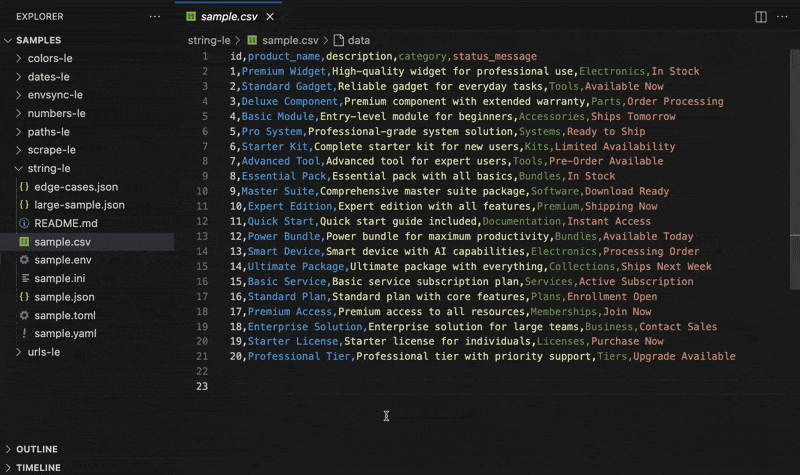

<p align="center">
  
</p>
<h1 align="center">Strings-LE: Zero Hassle String Extraction</h1>
<p align="center">
  <b>Instantly extract every user-visible string in precise order</b><br/>
  <i>JSON, YAML, CSV, TOML, INI, ENV</i>
</p>

<p align="center">
  <!-- Build -->
  <a href="https://github.com/OffensiveEdge/string-le/actions">
    
  </a>
</p>

<p align="center">
  <i>Tested on <b>Ubuntu</b>, <b>macOS</b>, and <b>Windows</b> for maximum compatibility.</i>
</p>

---

<p align="center">
  
</p>

<p align="center">
  
</p>

## 🙏 Thank You

If String-LE saves you time, a quick rating helps other developers discover it:  
⭐ [VS Code Marketplace](https://marketplace.visualstudio.com/items?itemName=nolindnaidoo.string-le) • [Open VSX](https://open-vsx.org/extension/OffensiveEdge/string-le)

## ✅ Why String-LE?

Extract strings from **any file format** — JSON, CSV, ENV, YAML, TOML — in one click. No regex. No scripts. Just results.

String-LE intelligently identifies **user-visible text** while filtering out numbers, IDs, URLs, and technical noise. Get a clean, ordered set of strings ready for i18n, documentation, or validation.

- **i18n without the hassle**

  Instantly extract and de-duplicate locale strings into `en.json`, `fr.json`, or any language pack. Keep translation files lean and in sync across your codebase.

- **Clarity across configs & APIs**  
  Surface every user-facing message. Validation errors, system prompts, and API responses are cataloged in one place.

- **Confident edits in complex specs**  
  Flatten nested strings into a simple list you can safely edit without breaking structure or formatting.

- **Stream massive CSVs**  
  Work with millions of rows without locking up VS Code. Select only the columns you need and stream results directly to the editor.

- **Automatic cleanup built-in**

  - **Sort** for stable diffs and reviews
  - **Dedupe** to eliminate noise

- **Fast at any scale**  
  Efficiently processes large datasets and enterprise monorepos without slowing you down.

## 🚀 More from the LE Family

- **[Numbers-LE](https://marketplace.visualstudio.com/items?itemName=nolindnaidoo.numbers-le)** - Extract and analyze numeric data with statistics • [Open VSX](https://open-vsx.org/extension/OffensiveEdge/numbers-le)
- **[EnvSync-LE](https://marketplace.visualstudio.com/items?itemName=nolindnaidoo.envsync-le)** - Keep .env files in sync with visual diffs • [Open VSX](https://open-vsx.org/extension/OffensiveEdge/envsync-le)
- **[Paths-LE](https://marketplace.visualstudio.com/items?itemName=nolindnaidoo.paths-le)** - Extract file paths from imports and dependencies • [Open VSX](https://open-vsx.org/extension/OffensiveEdge/paths-le)
- **[URLs-LE](https://marketplace.visualstudio.com/items?itemName=nolindnaidoo.urls-le)** - Audit API endpoints and external resources • [Open VSX](https://open-vsx.org/extension/OffensiveEdge/urls-le)
- **[Scrape-LE](https://marketplace.visualstudio.com/items?itemName=nolindnaidoo.scrape-le)** - Validate scraper targets before debugging • [Open VSX](https://open-vsx.org/extension/OffensiveEdge/scrape-le)
- **[Colors-LE](https://marketplace.visualstudio.com/items?itemName=nolindnaidoo.colors-le)** - Extract and analyze colors from stylesheets • [Open VSX](https://open-vsx.org/extension/OffensiveEdge/colors-le)
- **[Dates-LE](https://marketplace.visualstudio.com/items?itemName=nolindnaidoo.dates-le)** - Extract temporal data from logs and APIs • [Open VSX](https://open-vsx.org/extension/OffensiveEdge/dates-le)

## 💡 Use Cases

- **i18n & Localization** - Extract user-visible strings for translation files and language packs
- **Content Management** - Pull titles, descriptions, and messages from CMS exports for auditing
- **API Validation** - Extract user-facing messages and errors from API responses for documentation
- **Documentation Audits** - Get all text content from docs for reviews and updates

## 🚀 Quick Start

1. **Install from VS Code Marketplace or Open VSX**
   - VS Code Marketplace: [Install here](https://marketplace.visualstudio.com/items?itemName=nolindnaidoo.string-le)
   - Open VSX (Cursor, VSCodium): [Install here](https://open-vsx.org/extension/OffensiveEdge/string-le)
2. Open any supported file type (`Cmd/Ctrl + P String-LE`).
3. Run Quick Extract (`Cmd+Alt+E` / `Ctrl+Alt+E` / Status Bar).

## ⚙️ Configuration

### Basic Settings

- `string-le.openResultsSideBySide` – Open to the side
- `string-le.csv.streamingEnabled` – Toggle CSV streaming
- `string-le.dedupeEnabled` – Auto-dedupe strings
- `string-le.sortEnabled` – Auto-sort output

### Advanced Options

- **Safety Guards** – File size warnings & thresholds
- **Notification Levels** – Control verbosity and alerts

### Real-World Configuration Examples

**i18n Workflow**

```json
{
  "string-le.openResultsSideBySide": true,
  "string-le.dedupeEnabled": true,
  "string-le.sortEnabled": true,
  "string-le.csv.streamingEnabled": false
}
```

**Large Dataset Processing**

```json
{
  "string-le.csv.streamingEnabled": true,
  "string-le.dedupeEnabled": false,
  "string-le.sortEnabled": false,
  "string-le.openResultsSideBySide": false
}
```

**Content Audit**

```json
{
  "string-le.dedupeEnabled": true,
  "string-le.sortEnabled": true,
  "string-le.openResultsSideBySide": true,
  "string-le.csv.streamingEnabled": false
}
```

### ⚠️ Behaviors & Limits

- CSV support assumes standard delimiter/quoting; unusual dialects not supported
- Large outputs can be slow to open — use **Copy** when prompted
- Streaming applies only to CSV; other formats load in memory
- Multi-line strings (e.g., YAML block scalars) are only partially supported
- CSV multi-line and all-column extracts stream to the editor only (no auto-copy)
- Sorting and deduplication apply to final strings, not their original positions
- Fallback mode uses quoted-string heuristics and may include false positives

See [`CONFIGURATION.md`](docs/CONFIGURATION.md).

## ⚡ Performance

<!-- PERFORMANCE_START -->

String-LE is built for speed and handles files from 100KB to 30MB+. See [detailed benchmarks](docs/PERFORMANCE.md).

| Format   | File Size | Throughput | Duration | Memory | Tested On     |
| -------- | --------- | ---------- | -------- | ------ | ------------- |
| **JSON** | 0.13MB    | 4703509    | ~1.14    | < 1MB  | Apple Silicon |
| **JSON** | 1.31MB    | 6337898    | ~8.47    | < 1MB  | Apple Silicon |
| **JSON** | 6.55MB    | 6181529    | ~43.42   | < 1MB  | Apple Silicon |
| **ENV**  | 5K lines  | 1,144,828  | ~0.29    | < 1MB  | Apple Silicon |

**Note**: CSV format tests encountered parsing errors with generated test data. Real-world CSV performance may vary.  
**Real-World Performance**: Tested with actual data up to 20MB (practical limit: 1MB warning, 10MB error threshold)  
**Performance Monitoring**: Built-in real-time tracking with configurable thresholds  
**Full Metrics**: [docs/PERFORMANCE.md](docs/PERFORMANCE.md) • Test Environment: macOS, Bun 1.2.22, Node 22.x

<!-- PERFORMANCE_END -->

- **Sorting**: Adds 10-20% processing time when enabled
- **Hardware Requirements**: Minimum 4GB RAM, recommended 8GB+ for large datasets

See [`PERFORMANCE.md`](docs/PERFORMANCE.md).

## 🌍 Language Support

**13 languages**: English, German, Spanish, French, Indonesian, Italian, Japanese, Korean, Portuguese (Brazil), Russian, Ukrainian, Vietnamese, Chinese (Simplified)

## 🧩 System Requirements

**VS Code** 1.70.0+ • **Platform** Windows, macOS, Linux  
**Memory** 500MB recommended for large files

## 🔒 Privacy

100% local processing. No data leaves your machine. Optional logging: `string-le.telemetryEnabled`

## 🔧 Troubleshooting

**Not detecting strings?**  
Ensure file is saved with supported extension (.json, .yaml, .csv, .toml, .ini, .env)

**Large files slow?**  
Enable CSV streaming: `string-le.csv.streamingEnabled: true`

**Need help?**  
Check [Issues](https://github.com/OffensiveEdge/string-le/issues) or enable logging: `string-le.telemetryEnabled: true`

## ❓ FAQ

**What strings are extracted?**  
User-visible text only (excludes IDs, numbers, technical values, variable names)

**Can I get deduplication?**  
Yes, enable `string-le.dedupeEnabled: true` to remove duplicates automatically

**Max file size?**  
Up to 500MB with CSV streaming. Practical limit: 10MB for other formats

**Perfect for i18n?**  
Absolutely! Extract strings for translation files, locale management, and content audits

## 📊 Testing

**92 unit tests** • **93.64% function coverage, 91.76% line coverage**  
Powered by Vitest • Run with `bun test --coverage`

See [`TESTING.md`](docs/TESTING.md).

---

Copyright © 2025  
<a href="https://github.com/OffensiveEdge">@OffensiveEdge</a>. All rights reserved.
