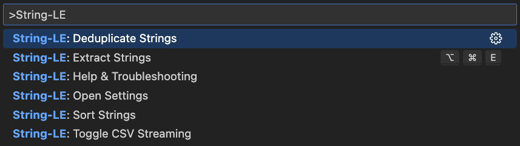

<p align="center">
  
</p>
<h1 align="center">Strings-LE: Zero Hassle String Extraction</h1>
<p align="center">
  <b>Instantly extract every user-visible string in precise order</b><br/>
  <i>JSON, YAML, CSV, TOML, INI, ENV</i>
</p>

<p align="center">
  <!-- VS Code Marketplace -->
  <a href="https://marketplace.visualstudio.com/items?itemName=nolindnaidoo.string-le">
    
  </a>
  <!-- Open VSX -->
  <a href="https://open-vsx.org/extension/nolindnaidoo/string-le">
    
  </a>
  <!-- Build -->
  <a href="https://github.com/nolindnaidoo/string-le/actions">
    
  </a>
  <!-- License -->
  <a href="https://github.com/nolindnaidoo/string-le/blob/main/LICENSE">
    
  </a>
</p>

<p align="center">
  <i>Tested on <b>Ubuntu</b>, <b>macOS</b>, and <b>Windows</b> for maximum compatibility.</i>
</p>

---

<p align="center">
  
</p>

<p align="center">
  
</p>

## 🙏 Thank You!

Thank you for using Strings-LE! If this extension has been helpful in extracting and managing your strings, please consider leaving a rating on [VS Code Marketplace](https://marketplace.visualstudio.com/items?itemName=nolindnaidoo.string-le) and [Open VSX](https://open-vsx.org/extension/nolindnaidoo/string-le). Your feedback helps other developers discover this tool and motivates continued development.

⭐ **Enjoying Strings-LE?** [Leave a rating](https://marketplace.visualstudio.com/items?itemName=nolindnaidoo.string-le) and help others find it too!

## ✅ Why Strings-LE

**Modern projects scatter text everywhere** — APIs, configs, CSVs, and locale files across both native and web. Keeping those strings consistent is still a slow, manual grind.

**Strings-LE makes extraction effortless.**  
It smartly pulls out only the **true user-visible strings** (never numbers, IDs, or raw values) and gives you a clean, ordered set of text that’s ready for production.

- **i18n without the hassle**

  Instantly extract and de-duplicate locale strings into `en.json`, `fr.json`, or any language pack. Keep translation files lean and in sync across your codebase.

- **Clarity across configs & APIs**  
  Surface every user-facing message. Validation errors, system prompts, and API responses are cataloged in one place.

- **Confident edits in complex specs**  
  Flatten nested strings into a simple list you can safely edit without breaking structure or formatting.

- **Stream massive CSVs**  
  Work with millions of rows without locking up VS Code. Select only the columns you need and stream results directly to the editor.

- **Automatic cleanup built-in**

  - **Sort** for stable diffs and reviews
  - **Dedupe** to eliminate noise
  - **Trim whitespace** (NEW)

- **Fast at any scale**  
  Benchmarked at millions of lines per second, String-LE keeps up with large datasets and enterprise monorepos without slowing you down.

## 🚀 More from the LE Family

**Strings-LE** is part of a growing family of developer tools designed to make your workflow effortless:

- **EnvSync-LE** - Effortlessly detect, compare, and synchronize .env files across your workspace with visual diffs  
  [[VS Code Marketplace](https://marketplace.visualstudio.com/items?itemName=nolindnaidoo.envsync-le)] [[Open VSX](https://open-vsx.org/extension/nolindnaidoo/envsync-le)]

- **Numbers-LE** - Extract and analyze numeric data from JSON, YAML, CSV, TOML, INI, and .env files  
  [[VS Code Marketplace](https://marketplace.visualstudio.com/items?itemName=nolindnaidoo.numbers-le)] [[Open VSX](https://open-vsx.org/extension/nolindnaidoo/numbers-le)]

- **Paths-LE** - Extract and analyze file paths from imports, configs, and dependencies  
  [[VS Code Marketplace](https://marketplace.visualstudio.com/items?itemName=nolindnaidoo.paths-le)] [[Open VSX](https://open-vsx.org/extension/nolindnaidoo/paths-le)]

- **Scrape-LE** - Verify page reachability and detect anti-scraping measures before deploying scrapers  
  [[VS Code Marketplace](https://marketplace.visualstudio.com/items?itemName=nolindnaidoo.scrape-le)]

- **Colors-LE** - Extract and analyze colors from CSS, HTML, JavaScript, and TypeScript  
  [[VS Code Marketplace](https://marketplace.visualstudio.com/items?itemName=nolindnaidoo.colors-le)] [[Open VSX](https://open-vsx.org/extension/nolindnaidoo/colors-le)]

- **Dates-LE** - Extract and analyze dates from logs, APIs, and temporal data  
  [[VS Code Marketplace](https://marketplace.visualstudio.com/items?itemName=nolindnaidoo.dates-le)] [[Open VSX](https://open-vsx.org/extension/nolindnaidoo/dates-le)]

- **URLs-LE** - Extract and analyze URLs from web content, APIs, and resources  
  [[VS Code Marketplace](https://marketplace.visualstudio.com/items?itemName=nolindnaidoo.urls-le)] [[Open VSX](https://open-vsx.org/extension/nolindnaidoo/urls-le)]

Each tool follows the same philosophy: **Zero Hassle, Maximum Productivity**.

## 💡 Use Cases & Examples

### Internationalization (i18n)

Extract user-visible strings for translation:

```json
// Extract from app.json
{
  "welcome": "Welcome to our application",
  "error": "Something went wrong",
  "success": "Operation completed successfully"
}
```

### Content Management

Extract content from CMS exports:

```csv
// Extract from content.csv
id,title,description,category
1,"New Product Launch","Introducing our latest innovation","Products"
2,"Company Update","Important news about our services","News"
```

### API Response Analysis

Extract user-facing messages from API responses:

```json
// Extract from api-responses.json
{
  "message": "User created successfully",
  "error": "Invalid email format",
  "warning": "Password too weak"
}
```

### Documentation Extraction

Extract text content from documentation files for content audits and updates.

## 🚀 Quick Start

1. **Install from VS Code Marketplace or Open VSX**
   - VS Code Marketplace: [Install here](https://marketplace.visualstudio.com/items?itemName=nolindnaidoo.string-le)
   - Open VSX (Cursor, VSCodium): [Install here](https://open-vsx.org/extension/nolindnaidoo/string-le)
2. Open any supported file type (`Cmd/Ctrl + P String-LE`).
3. Run Quick Extract (`Cmd+Alt+E` / `Ctrl+Alt+E` / Status Bar).

## ⚙️ Configuration

### Basic Settings

- `string-le.openResultsSideBySide` – Open to the side
- `string-le.csv.streamingEnabled` – Toggle CSV streaming
- `string-le.dedupeEnabled` – Auto-dedupe strings
- `string-le.sortEnabled` – Auto-sort output

### Advanced Options

- **Safety Guards** – File size warnings & thresholds
- **Notification Levels** – Control verbosity and alerts

### Real-World Configuration Examples

**i18n Workflow**

```json
{
  "string-le.openResultsSideBySide": true,
  "string-le.dedupeEnabled": true,
  "string-le.sortEnabled": true,
  "string-le.csv.streamingEnabled": false
}
```

**Large Dataset Processing**

```json
{
  "string-le.csv.streamingEnabled": true,
  "string-le.dedupeEnabled": false,
  "string-le.sortEnabled": false,
  "string-le.openResultsSideBySide": false
}
```

**Content Audit**

```json
{
  "string-le.dedupeEnabled": true,
  "string-le.sortEnabled": true,
  "string-le.openResultsSideBySide": true,
  "string-le.csv.streamingEnabled": false
}
```

### ⚠️ Behaviors & Limits

- CSV support assumes standard delimiter/quoting; unusual dialects not supported
- Large outputs can be slow to open — use **Copy** when prompted
- Streaming applies only to CSV; other formats load in memory
- Multi-line strings (e.g., YAML block scalars) are only partially supported
- CSV multi-line and all-column extracts stream to the editor only (no auto-copy)
- Sorting and deduplication apply to final strings, not their original positions
- Fallback mode uses quoted-string heuristics and may include false positives

See [`CONFIGURATION.md`](docs/CONFIGURATION.md).

## ⚡ Performance

String-LE is built for speed across all supported formats:

| Format   | Throughput      | Best For               | File Size Range | Hardware Tested  |
| -------- | --------------- | ---------------------- | --------------- | ---------------- |
| **ENV**  | 4M+ lines/sec   | Environment configs    | 1KB - 5MB       | M1 Mac, Intel i7 |
| **JSON** | 1.8M+ lines/sec | APIs, large datasets   | 1KB - 200MB     | M1 Mac, Intel i7 |
| **INI**  | 1.3M+ lines/sec | Configuration files    | 1KB - 10MB      | M1 Mac, Intel i7 |
| **TOML** | 530K+ lines/sec | Modern configs         | 1KB - 25MB      | M1 Mac, Intel i7 |
| **CSV**  | 440K+ lines/sec | Tabular data           | 1KB - 500MB     | M1 Mac, Intel i7 |
| **YAML** | 190K+ lines/sec | Human-readable configs | 1KB - 50MB      | M1 Mac, Intel i7 |

### Performance Notes

- **Memory Usage**: ~100MB base + 2MB per 1000 strings processed
- **Large Files**: Files over 100MB may show reduced throughput (100K-500K lines/sec)
- **CSV Streaming**: Enables processing of files up to 500MB without memory issues
- **Deduplication**: Adds 20-30% processing time when enabled
- **Sorting**: Adds 10-20% processing time when enabled
- **Hardware Requirements**: Minimum 4GB RAM, recommended 8GB+ for large datasets

See [`PERFORMANCE.md`](docs/PERFORMANCE.md).

## 🌍 Language Support

English + 12 translations:

- Chinese (Simplified), Spanish, French, Russian, Portuguese (Brazil)
- Japanese, Korean, German, Italian, Vietnamese, Ukrainian, Indonesian

See [`I18N.md`](docs/I18N.md).

## 🧩 System Requirements

- **VS Code**: 1.85.0 or higher
- **Node.js**: Not required (extension runs in VS Code's built-in runtime)
- **Platform**: Windows, macOS, Linux
- **Memory**: 100MB minimum, 500MB recommended for large datasets
- **Storage**: 20MB for extension files

## 🔒 Privacy & Telemetry

- Runs entirely locally; no data is sent off your machine.
- Optional local-only logs can be enabled with `string-le.telemetryEnabled`.
- Logs appear in Output panel → "String-LE".

See [`PRIVACY.md`](docs/PRIVACY.md).

## 🔧 Troubleshooting

### Common Issues

**Extension not detecting strings**

- Ensure file is saved and has a supported extension (.json, .yaml, .csv, .toml, .ini, .env)
- Check that the file contains user-visible strings (not just IDs or numbers)
- Try reloading VS Code window (`Ctrl/Cmd + Shift + P` → "Developer: Reload Window")

**Performance issues with large files**

- Files over 50MB may take longer to process
- Enable `string-le.csv.streamingEnabled: true` for CSV files
- Consider using `string-le.dedupeEnabled: false` to reduce processing time
- Disable sorting with `string-le.sortEnabled: false` for faster extraction

**Strings not appearing in results**

- Verify the content contains user-visible strings (not IDs, numbers, or technical values)
- Check if strings are inside comments or special sections
- Ensure strings are properly quoted in the source file
- Some formats may require specific parsing settings

**CSV streaming issues**

- Ensure CSV has proper headers for column selection
- Check that `string-le.csv.streamingEnabled` is enabled
- Verify CSV delimiter is standard (comma, semicolon, tab)
- Large CSV files may require streaming to avoid memory issues
- Multi-line strings in CSV may not be fully supported

**Deduplication problems**

- Enable `string-le.dedupeEnabled: true` for automatic deduplication
- Check that similar strings are not being incorrectly merged
- Some strings may appear different but are actually duplicates
- Case sensitivity may affect deduplication results

**Sorting issues**

- Enable `string-le.sortEnabled: true` for automatic sorting
- Sorting applies to final strings, not their original positions
- Locale-specific sorting may vary by system settings
- Some special characters may affect sort order

**Extension crashes or freezes**

- Check VS Code version compatibility (requires 1.85.0+)
- Disable other string-related extensions temporarily
- Check Output panel → "String-LE" for error messages
- Consider reducing file size or using streaming mode

### Getting Help

- Check the [Issues](https://github.com/nolindnaidoo/string-le/issues) page for known problems
- Enable telemetry logging: `string-le.telemetryEnabled: true`
- Review logs in Output panel → "String-LE"
- See [`TROUBLESHOOTING.md`](docs/TROUBLESHOOTING.md) for detailed guidance

## ❓ FAQ

**Q: What types of strings are extracted?**
A: String-LE extracts user-visible strings (text that users see) while excluding IDs, numbers, technical values, and variable names.

**Q: Can I extract strings from comments?**
A: String-LE focuses on user-visible content, so comments are typically excluded. The extension is designed to extract strings that end users will see.

**Q: How does deduplication work?**
A: When `string-le.dedupeEnabled: true` is enabled, String-LE automatically removes duplicate strings from the results, keeping only unique entries.

**Q: Can I sort the extracted strings?**
A: Yes, enable `string-le.sortEnabled: true` to automatically sort strings alphabetically. This helps with translation workflows and content management.

**Q: How does CSV streaming work?**
A: When `string-le.csv.streamingEnabled: true` is enabled, large CSV files are processed in chunks to avoid memory issues. You can select specific columns for extraction.

**Q: What's the largest file size supported?**
A: String-LE can handle files up to 500MB with CSV streaming enabled. For other formats, the limit is around 200MB for optimal performance.

**Q: Does String-LE work with i18n files?**
A: Absolutely! String-LE is perfect for extracting strings for internationalization, creating translation files, and managing locale content.

## 📊 Test Coverage

- 137 passing tests across 18 test suites with comprehensive extraction coverage
- Core extraction and transform modules have excellent coverage
- Contract tests for configuration side-effects and parse-error handling
- Data-driven fixtures with golden expected outputs per format
- Tests powered by Vitest
- Runs quickly and locally: `bun run test`

See [`TESTING.md`](docs/TESTING.md).

---

Copyright © 2025  
<a href="https://github.com/nolindnaidoo">@nolindnaidoo</a>. All rights reserved.
